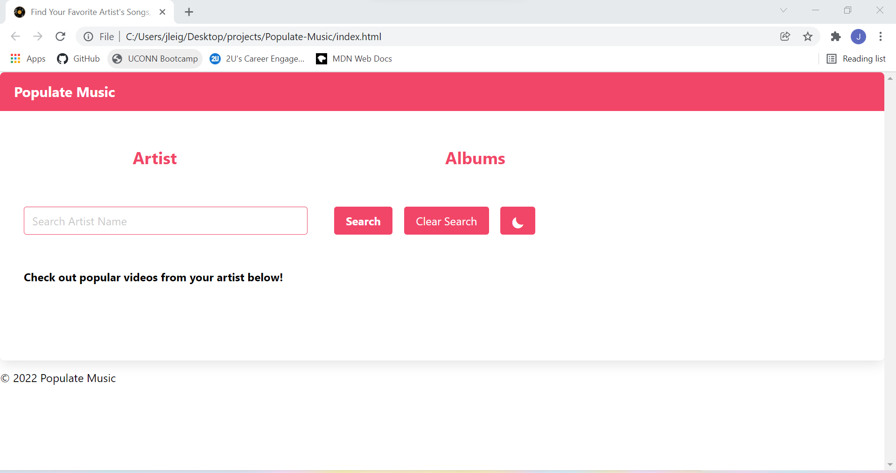
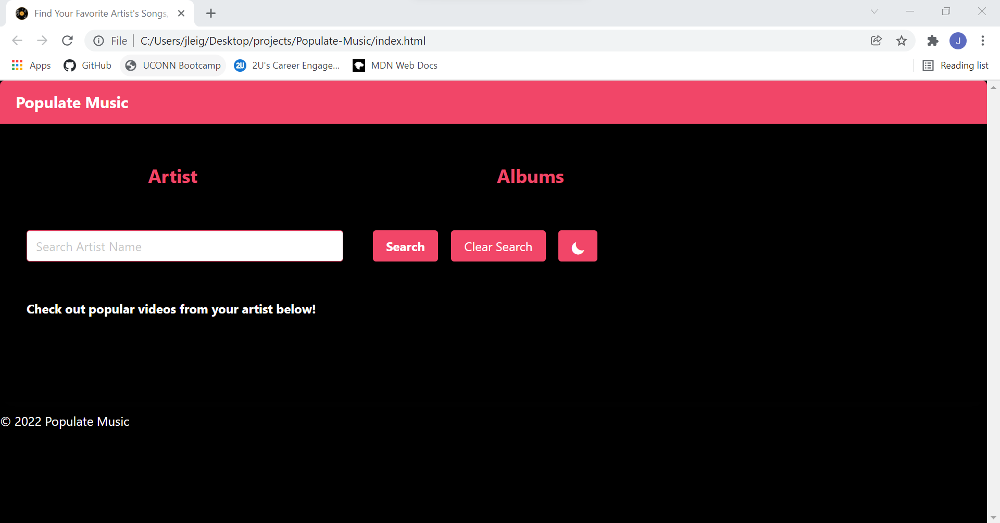
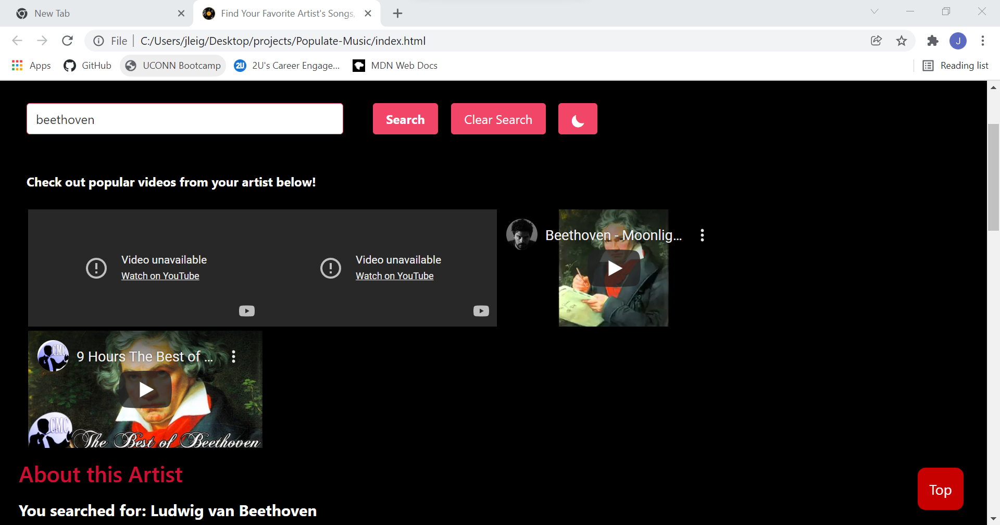
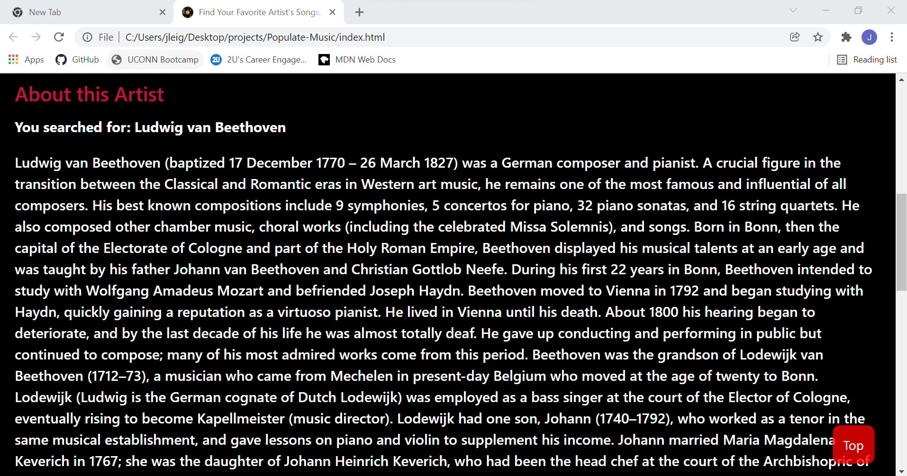
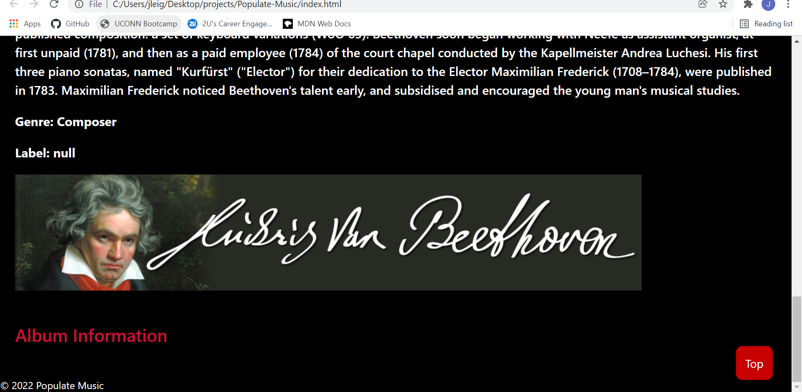

# Populate Music

## Project Description:

Have you ever searched for a musical artist online and endlessly scrolled to find lackluster or dissatisfying information? Our webpage developers have experienced the same level of frustration. So, we've created a revolutionary music page to reshape the market called, Populate Music. Populate Music provides an aestically pleasing web experience where users can read an artist's biography, watch their music videos, and view their discography in one place.

Users enter the name of an artist in the search bar and are able to view related content including music videos, biographical information, and album details. The webpage is styled utilizing CSS and Bulma while utilizing APIs from YouTube and AudioDB to assist with user enjoyment. The "dark mode" feature is an option available for users to reduce eye strain and decrease light sensitivity for those who may suffer from visual impairment.

## Purpose:

A website that offers users access to view a musical artist's biography, discography, and musical content.

## Built With:

*HTML
*CSS
*Javascript
*Bulma (CSS based framework)
\*JQuery
APIs (from YouTube and AudioDB)

## Website:

Deployed Link: https://jlcunningham2101.github.io/Populate-Music/
GitHub Repo: https://github.com/jlcunningham2101/Populate-Music

## Webpage Images:

An example of the homepage:

An example of the webpage in night-mode:

An example of the video results from an artist search:

An example of the biographical information from an artist search:

An example of the discography from an artist search:

## Contribution:

Website created by Jillian Cunningham, Aaron Laramee, Daniel Mendez, and Tresha-Gaye Ustanny

## User Story:

AS A music lover
I WANT to view a musical artist's content on a webpage
SO THAT I can learn more about the artist and view/watch samples of their work (i.e. music videos, biograpical information about the artist, and album details)

## Acceptance Criteria:

GIVEN I want to view, read, and watch content related to a specific artist
WHEN I search for the artists' name or an album title
THEN I am presented with the musical artist's biography, discography, and content from YouTube and AudioDB to watch, listen to, or read on the webpage

WHEN I click the "Clear Search" button
THEN I will be able to erase previous artist or album related searches from my webpage

WHEN I click the "moon" icon button
THEN I will be presented with a "dark mode" webpage

WHEN I click the "Artist" header
THEN I will be brought to the "About this Artist" section of the webpage

WHEN I click the "Albums" header
THEN I will be brought to the "Album Information" section of the webpage

WHEN I click the "Top" button
THEN I will be brought back to the top of the webpage

WHEN I resize the page or view the site on various screens and devices
THEN I am presented with a responsive layout that adapts to my viewport

## Challenges to Address for Future Improvements:

1. ID why an empty search/string returns a result for music videos and biographical information
2. Error handling - when an error is found and the user is prompted, the page isn't easily reset for new searches
